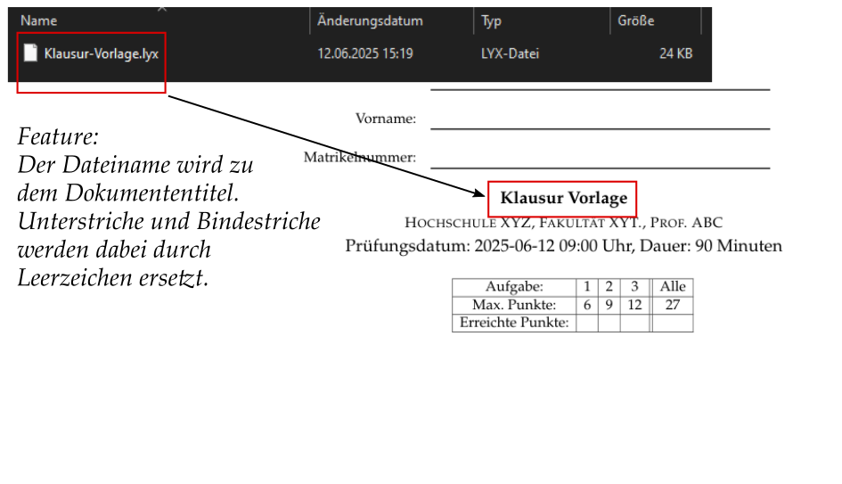
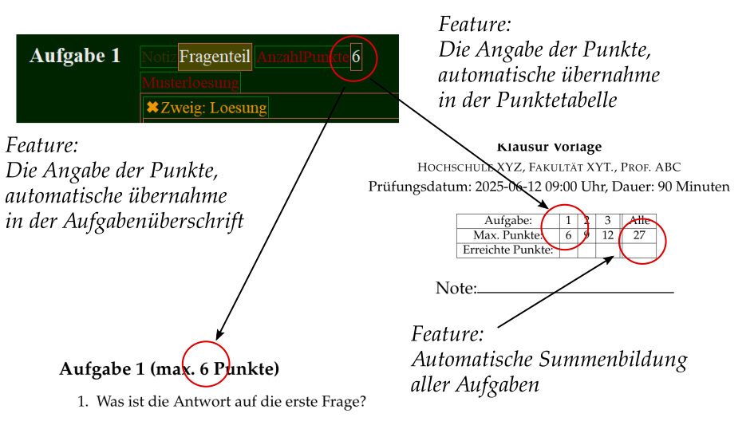
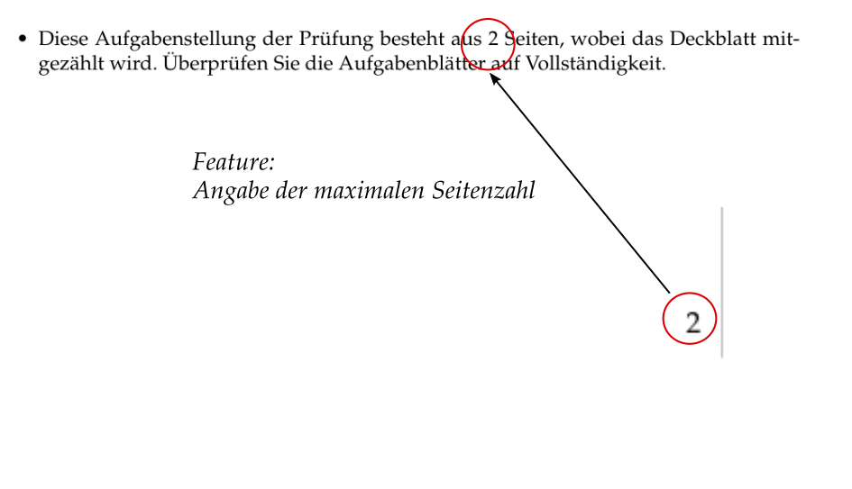
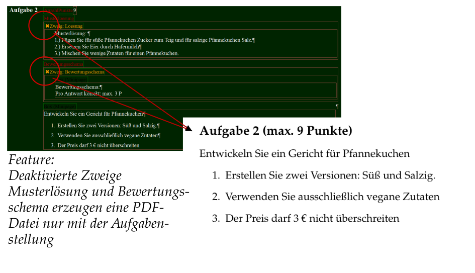
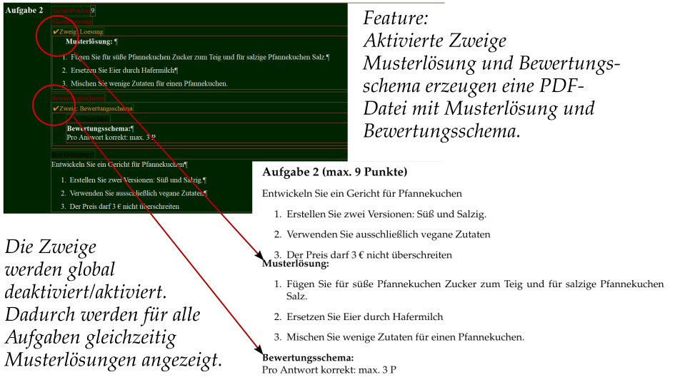
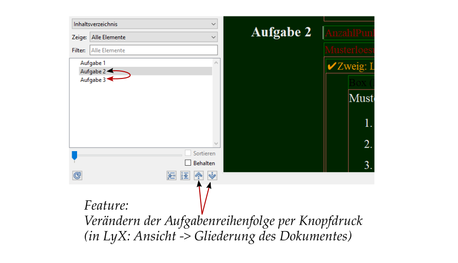

# Klausurvorlage

Dies ist eine Vorlage für Klausuren oder Prüfungen in der Form einer LyX- und LaTeX-Datei.
Diese Vorlage hat folgende Mermale:

## Dateiname ist Dokumentenüberschrift

Der Dateiname wird automatisch als Dokumententitel (Überschrift in dem Dokument) gesetzt. Dabei werden Bindestriche oder Unterstriche durch Leerzeichen ersetzt. Dies zeigt die folgende Abbildung:

Häufig wird ein Dateiname so gewählt, dass er auf den Inhalt des Dokumentes entspricht. Dasselbe gilt für den Dokumententitel. Es wird dabei eine doppelte Datenhaltung betrieben, die Fehler mit sich bringen kann.

## Zentrale Angabe der Punkte pro Aufgabe
In der Vorlage wird nur an einer Stelle angegeben, wieviele Punkte es für jede Aufgabe gibt. Die Übersichtstabelle, welche zeigt, wie viele Punkte es pro Aufgabe gibt, und die Gesamtpunktzahl angibt, wird automatisch generiert. 

## Eine Angabe der gesamten Seitenanzahl wird in der Einleitung automatisch angezeigt. 

## Deaktivierte Musterlösung
Die LyX-Datei enthält Zweige, in der die Musterlösung enthalten ist. Die Musterlösung und der Bewertungsmaßstab werden in der PDF-Datei ausgeblendet, wenn diese Zweige deaktiviert sind  

## Aktivierte Musterlösung
Werden Zweige aktiviert, wird deren Inhalt in der PDF-Datei angezeigt. Zweige werden immer global deaktiviert und aktiviert. Das bedeutet, dass wenn die Musterlösung in der Aufgabe 1 angezeigt wird, dass sie auch in allen anderen Aufgaben angezeigt wird.

## Schnelles vertauschen der Reihenfolge
In LyX kann sehr schnell durch Knopfdruck die Reihenfolge der Aufgaben vertauscht werden. Dazu wird mit "Ansicht" -> "Gliederung des Dokumentes" die Dokumentgliederung angezeigt. Dort kann eine Aufgabe markiert und mit den beiden Pfeiltasten in der Reihenfolge nach oben oder unten verschoben werden. Da die Übersichtstabelle automatisch generiert wird, werden die Punkte in der Tabelle der richtigen Aufgabe zugeordnet.

